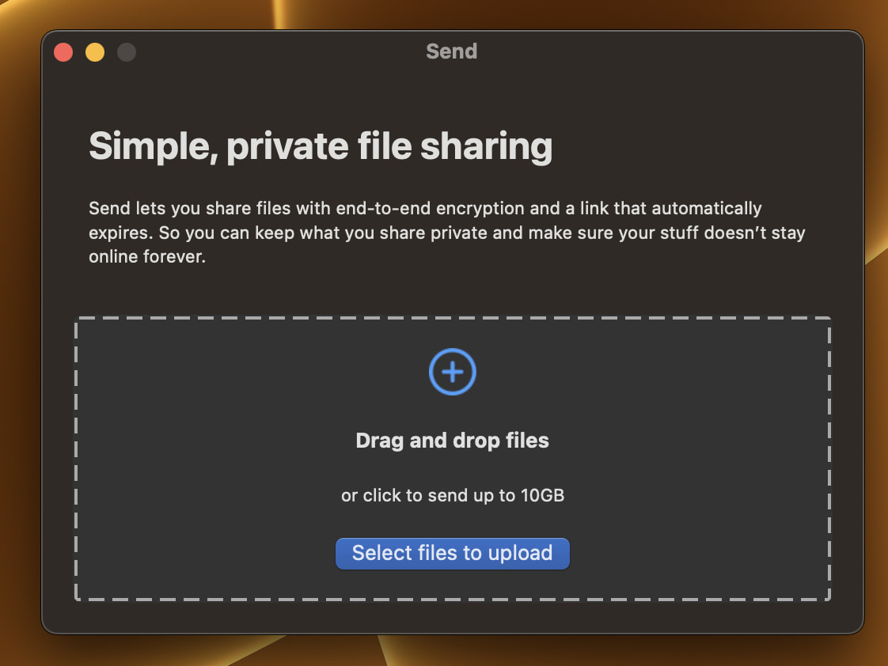
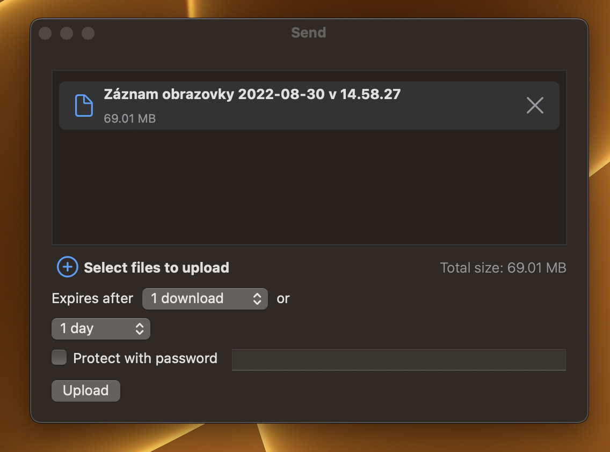
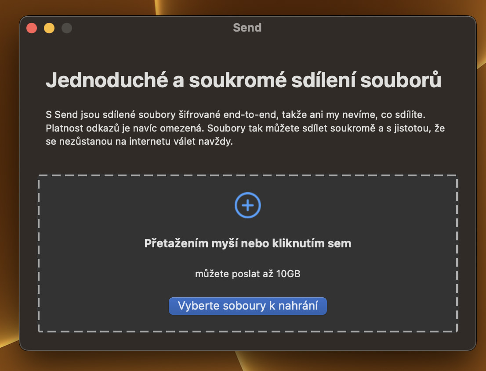
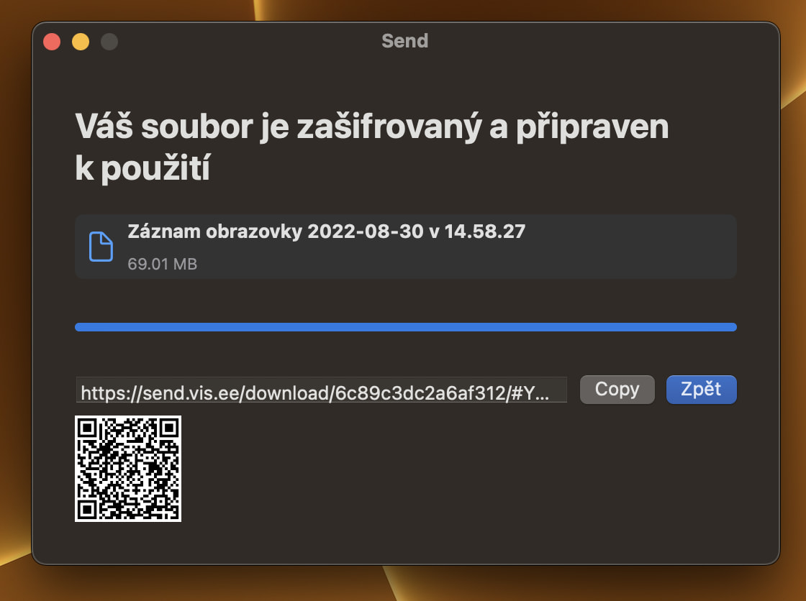

<h1 align="center"> </h1>

<h3 align="center">Send!</h3>

    macOS GUI and share extension for 🦊 Send
     
    <strong>Version: </strong>WIP (Unfinished)
     
     
    
    
    
     
     
    <a><strong>No downloads</strong></a>
     
     
    <a href="https://github.com/EETagent/Send/issues">Report issues</a>
  

## 🔔 Information

Send is still in development

## 👏 Dependencies

- `Maintained Send instance` https://send.vis.ee by [@timvisee](https://github.com/timvisee)
- `FFsend API library` [ffsend-api](https://github.com/timvisee/ffsend-api) by [@timvisee](https://github.com/timvisee)
- `ZIP library` [ZipArchive](https://github.com/ZipArchive/ZipArchive) by [@ZipArchive team](https://github.com/ZipArchive)

## 🖼️ Gallery

## 🎥 Video

